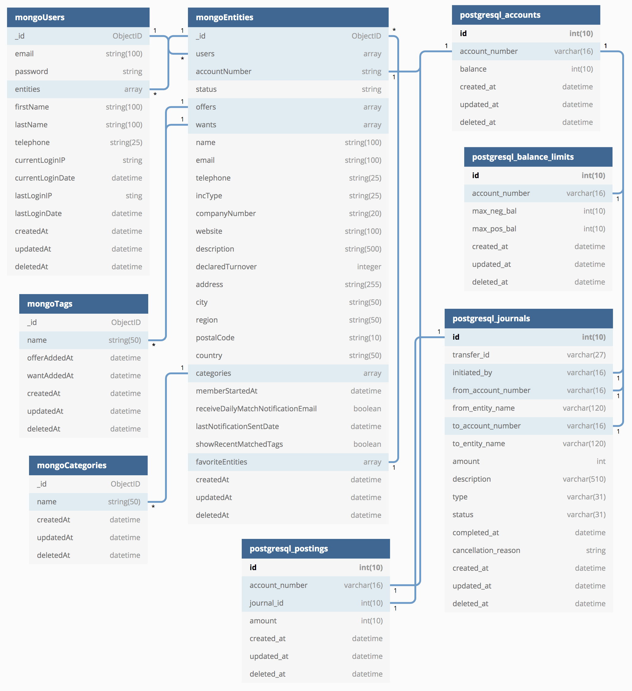

# Data Model - Alpha Release

The data model of MCCS is split between two databases: MongoDB and PostgreSQL. 

The SQL (PostgreSQL) DB records balances and MC transfers, since an [ACID](https://en.wikipedia.org/wiki/ACID)-compliant DB is required for consistent double-entry bookkeeping. The NoSQL (MongoDB) DB records all user, entity and category/tag information and was selected due to its flexibility because MCCS' requirements for its directory service will likely grow and change substantially.

Given that the transfer and directory functions will likely need to be split apart in the future into two separate (micro)services, databases that best fulfill the requirements of these services were chosen upfront.

The details of the data fields for each table in the data model are covered in the description of [MCCS functionality](alpha-functionality.md).

## Users

Database | Collection Name
--- | ---
MongoDB | `users`

Users are human beings, or software agents carrying out tasks on behalf of the human beings who operate them.

When a user signs up, a document is created in the `users` collection and an entity document, which is simultaneously created in the `entities` collection, is linked to the user.

A user document can be linked to multiple entity documents, which means a user can manage more than one entity.

## Entities

Database | Collection Name
--- | ---
MongoDB | `entities`

Entities can be companies, organizations or simply representations of a human being. An entity owns the account that the user controls in MCCS to make MC transfers. A typical entity might be a registered company or a non-profit organization.

An entity document can be linked to multiple user documents, which means an entity can be managed by more than one user.

If an individual user signs up and creates an entity that represents him/herself, the entity's name is simply the individual's name, not a company or organization name. The user (i.e., the individual) could then give access to that entity to another user (e.g., the individual's spouse), who can login with their own user ID and manage that entity on their spouse's behalf.

Although the alpha release focuses on a one-to-one relationship between users and entities, the data model caters for a many-to-many relationship, enabling its introduction in a future release.

## Tags and Categories

Database | Collection Names
--- | ---
MongoDB | `tags` & `categories`

Tags are descriptions of goods and services an entity can provide to other members in the community. They are used to facilitate trade discovery, enabling users to search for goods and services they need (_wants_) and to advertise goods and services they can provide (_offers_) to other users/entities. Tags are created and maintained for entities by their users.

Categories are a curated list of tags managed by the admin(s) of the MCCS node. Think of them like a directory heading in a phonebook ("Plumbers" or "Restaurants" in the Yellow Pages) that the admin assigns to each entity to organize them in a familiar way.

## Accounts and Balance Limits

Database | Table Names
--- | ---
PostgreSQL | `accounts` & `balance_limits`

The accounts table keeps track of the account number for each entity and its associated current balance of mutual credits.

The balance limits table records the maximum positive and negative balance for each entity's mutual credit account.

## Journal Entries and Postings

Database | Table Names
--- | ---
PostgreSQL | `journals` & `postings`

The journals table records mutual credit transfers between two entities. All relevant details of the transfer are stored here along with the transfer's current state (pending, completed or cancelled).

The postings table records the debits and credits between entity accounts for all completed mutual credit transfers. The sum total of all the entries in the posting table will always equal zero, provided that double-entry bookkeeping principles are always applied by the application's business logic.